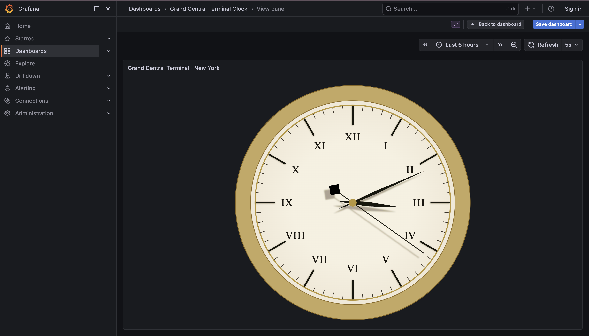
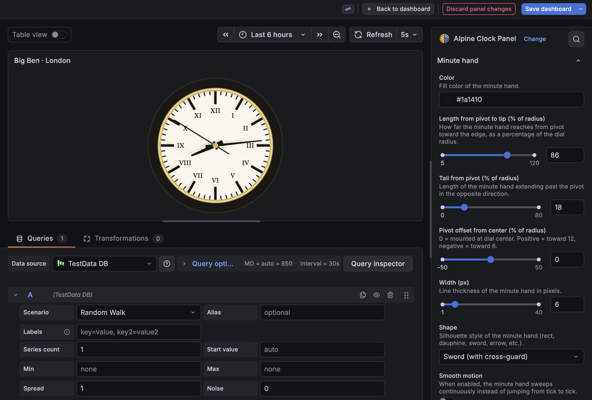
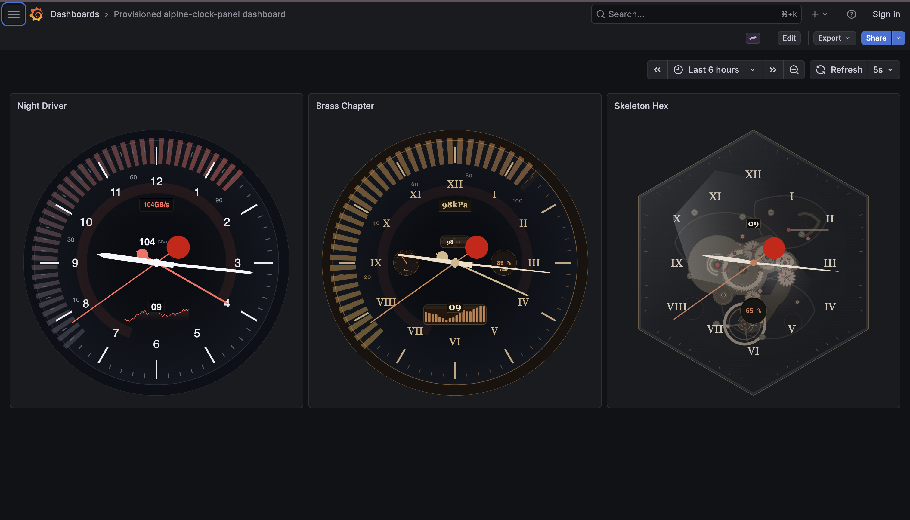
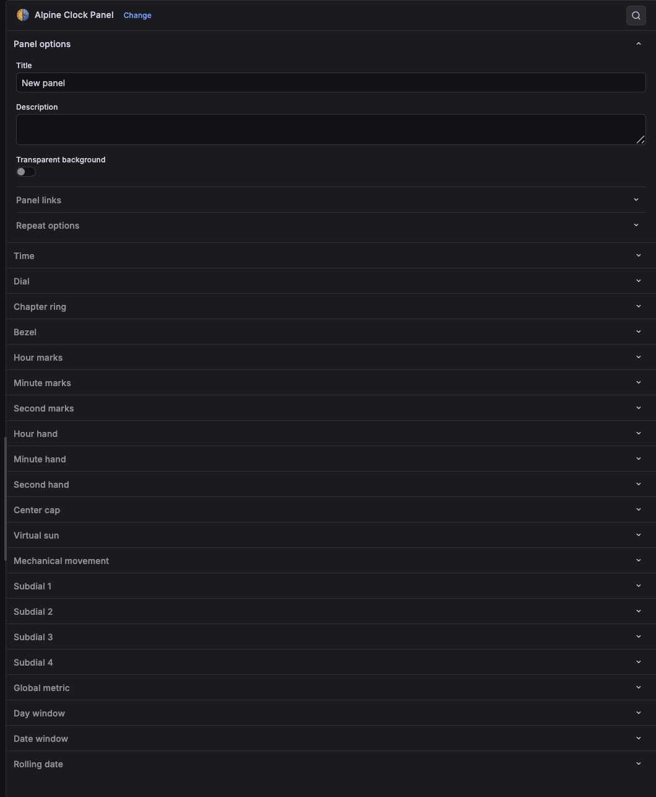

<p align="center">
  
</p>

<h1 align="center">Alpine Clock Panel</h1>

<p align="center">
  <strong>A watchmaker's toolkit for Grafana.</strong><br>
  Build analog clocks, instrument gauges, and mechanical watch faces<br>
  pixel by pixel — directly from the panel editor.
</p>

<p align="center">
  <a href="https://grafana.com/plugins/dzaczek-alpineclock-panel">Grafana Catalog</a> ·
  <a href="#screenshots">Screenshots</a> ·
  <a href="#quick-start">Quick Start</a> ·
  <a href="#features">Features</a> ·
  <a href="./docs/CONFIGURATION.md">Configuration Reference</a>
</p>

---

## Screenshots

<p align="center">
  
</p>
<p align="center"><em>Paradox of Plenty — 108 themed clocks across 9 design categories</em></p>

<p align="center">
  
  
</p>
<p align="center"><em>Landmark clocks: Grand Central Terminal, New York &amp; Big Ben, London</em></p>

<p align="center">
  
  
</p>
<p align="center"><em>Night Driver dashboard with global metric gauge &amp; panel editor with 274 options</em></p>

---

## Why Alpine Clock Panel?

Most clock panels give you a preset — you pick a style and tweak colors. Alpine Clock is different. It gives you **every gear, hand, and index as an independent control**, letting you assemble a clock face the way a watchmaker builds a movement.

- **274 configurable options** — shape, color, length, width, counterweight, bounce, and smooth motion for every hand
- **14 hand silhouettes** (baton, sword, dauphine, breguet, spade, skeleton…)
- **8 dial shapes** (round, oval, square, rectangle, hex-flat, hex-point)
- **4 numeral systems** (Arabic, Roman, circled Arabic, circled Roman)
- **13 provisioned dashboards** — from a 108-clock design catalog to landmark reproductions

---

## Features

### Core clock

- Timezone support via IANA timezone selector
- Stop-to-go second hand with configurable sweep/pause timing
- Damped harmonic bounce on discrete ticks (per-hand amplitude, damping, frequency)
- Virtual sun with dynamic hand + index shadows orbiting over 24 h

### Dials & bezels

- 8 geometric shapes with configurable corner radius on rect/square
- Solid, linear, and radial gradient fills with fade-to-transparent option
- Full bezel system: 12/24/60/60-all scales, major/minor ticks, rotation offset, upright or tangential numbers

### Complications

- **4 chronograph subdials** — each independently bindable to a data query, supporting analog (mini hand) or digital (numeric readout) modes with configurable thresholds
- **Global metric hand** — a large fourth hand sweeping across the whole dial, bound to any metric. Includes arc fill, threshold-driven coloring, value windows, scale rings, and a segmented gauge overlay (flat or mechanical cutout style)
- **Day-of-week window** — rectangular cutout with configurable format, curvature, and position
- **Date window** — day-of-month cutout, classic complication placement
- **Rolling date strip** — vertical three-row slot (prev / current / next day)

### Mechanical movement

- Transparent dial / skeleton mode with animated gear train, bridges, and ruby jewels
- Three drive modes: Run (escapement), Wind (crown winds mainspring), Set-time (minute works driven)

---

## Quick start

### Prerequisites

| Dependency | Version |
|---|---|
| Grafana | `>=12.3.0` |
| Node.js | `>=22` |
| npm | `>=10` |

### Install

```bash
# From the Grafana CLI
grafana-cli plugins install dzaczek-alpineclock-panel

# Or from source
git clone https://github.com/dzaczek/grafana-alpine-clock-panel.git
cd alpine-clock-panel
npm install
npm run build
```

### Local development

```bash
npm run dev          # watch mode — rebuilds on source change
npm run server       # start Grafana in Docker at http://localhost:3000
npm run typecheck    # TypeScript validation
npm run lint         # ESLint
npm run test:ci      # unit tests
npm run e2e          # Playwright e2e tests
npm run build        # production build → dist/
```

### Add your first clock

1. Open Grafana → New Dashboard → Add Visualization
2. Search for **Alpine Clock Panel** and select it
3. You'll see an analog clock with default settings
4. Open the panel editor (right sidebar) to explore the 274 options
5. For metric features, add a data query (e.g. `grafana-testdata-datasource` → `random_walk`)

### Explore the design catalog

The plugin ships with **13 provisioned dashboards**. Navigate to Dashboards to browse:

| Dashboard | Description |
|---|---|
| **Provisioned alpine-clock-panel dashboard** | 3 themed clocks: Night Driver, Brass Chapter, Skeleton Hex |
| **Alpine Clock — 156 examples** | Original design catalog |
| **Alpine Clock — 108 designs across 9 categories** | Thematic showcase: Retro, Modern, Cyberpunk, Fantasy, Rich, Metrics, Sport, Rails, Airplane |
| **Grand Central Terminal Clock** | Reproduction of the iconic New York station clock |
| **Big Ben — Elizabeth Tower Clock** | Victorian Gothic landmark clock |
| **World Exchanges — Trading Floor Clocks** | 14 clocks for major stock exchanges in local timezones |
| **Racing Chronograph** | Motorsport chronograph with tachymeter bezel |
| **Diver's Bezel** | Dive watch with 60-min bezel and luminous markers |
| **Flieger Type A** | Pilot watch with large arabic numerals |
| **Bauhaus** | Ultra-minimalist cream dial, baton hands |
| **Grand Complication** | All features active: 4 subdials, GM hand, skeleton, day+date |
| **Full-Featured Metrics Clock** | Cyber-themed metrics clock with subdials and GM gauge |
| **Large Clock with Shadow and Bouncing Hand** | Sun shadow demo with damped second-hand bounce |

---

## Project structure

```text
alpine-clock-panel/
├── src/
│   ├── module.ts                        # Panel options editor (274 options)
│   ├── types.ts                         # AlpineClockOptions type definitions
│   ├── timezones.ts                     # IANA timezone list
│   ├── plugin.json                      # Grafana plugin metadata
│   ├── components/
│   │   └── AlpineClockPanel.tsx          # Main rendering component
│   └── img/
│       ├── logo.svg
│       └── screenshot-*.png
├── provisioning/dashboards/             # 13 provisioned dashboards
├── docs/CONFIGURATION.md                # Full option reference
├── .github/workflows/ci.yml             # CI with provenance attestation
└── .config/                             # Webpack, Jest, bundler config
```

---

## Release & versioning

- Follows **Semantic Versioning** (`MAJOR.MINOR.PATCH`)
- Tags use the `v*` pattern (e.g. `v1.4.3`)
- CI builds, lints, tests, packages, signs, and attests provenance on every push to `main`
- Plugin catalog submission at https://grafana.com/plugins/dzaczek-alpineclock-panel

```bash
# Release flow
npm version patch   # or minor / major
git push origin main --follow-tags
```

---

## Contributing

Bug reports and feature requests: [GitHub Issues](https://github.com/dzaczek/grafana-alpine-clock-panel/issues)

If you have an idea for a new watch complication, hand shape, dial style, or mechanical behavior — open an issue. This plugin was built for tinkerers.

---

## License

[Apache 2.0](./LICENSE) © Dzaczek
